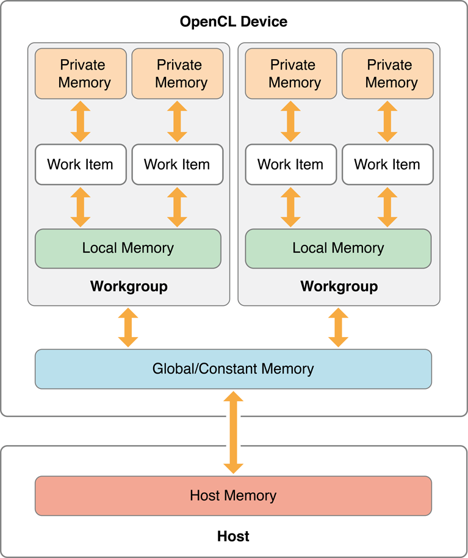
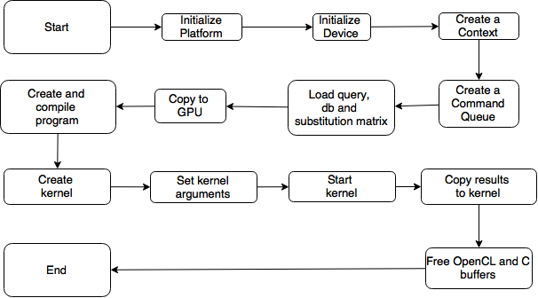
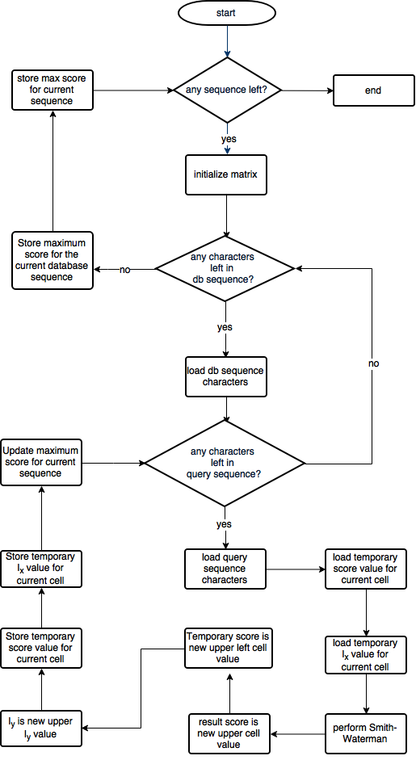

# Advanced Computing Systems - Lab 3 #

## OpenCL: Implementation of Protein Alignment ##

Protein sequence alignment is a method to arrange the sequences of protein to identify regions of similarity which might be an effect of functional, structural, or evolutionary relationships between the sequences. Similarities between sequences can be utilized to identify to find commonalities between organisms, or to infer an ancestral relation.

An example of sequence alignment algorithm is Smith-Waterman. Smith-Waterman algorithm uses dynamic programming method on protein alignment and has an ability to produce local alignment.

In Smith-Waterman, there are 3 phase required, which are : 
1. Initialization
2. Matrix Fill
3. Traceback

### Methods ###

There are two Smith-Waterman implementation that was done in C and CUDA environment. On both implementation, a deep analysis was done to understand the details of Smith-Waterman algorithm. Time measurement of previous implementation was also done to check the efficiency of currently built OpenCL version. The general implemenation in GPU is shown below.

A diagram of host side implementation on OpenCL can be seen on figure below, and kernel side implementation can be seen on figure below as well. As shown on figure below, on host side implementation on OpenCL, there are several differences compared to host side implementation on CUDA. Those differences can be summed up : initializing platform, initializing device, creating a context, creating a command queue, creating a program, compiling a program and creating kernel had to be explicitly  programmed in OpenCL. Meanwhile in kernel side implementation, both kernel side implementation in OpenCL and CUDA\cite{thesis} diagram has similar work flow.

Optimization steps using OpenCL : 

1. Change the TempColums Address Space Qualifier.
2. Adding More Work Items
3. Change the Data Type of Computation Variables Inside Kernel
4. Change the floating-point multiplication with Integer mul24 Built-in Function

### Results ###

We achieve a speed up of 1672.74 times compare to sequential benchmark implementation.

### Conclusion ###

1. OpenCL is a cross-platform parallel programming framework. Applying OpenCL has a main advantage to improve the speed and responsiveness of various applications, including protein alignment using Smith-Waterman Algorithm.

2. Parallel programming using CUDA and OpenCL has its own trade-off. CUDA provides more friendly language and interface, but it can only be applied on NVIDIA devices. While OpenCL can be applied to various devices or platform with different vendor, but its language is not as convenient as CUDA.